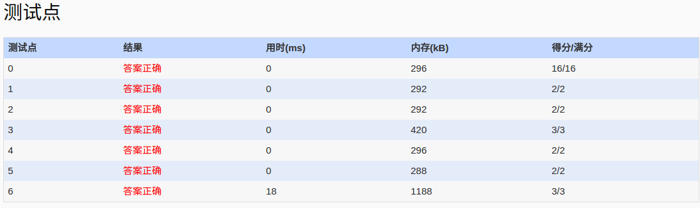

##1039. Course List for Student (25)
	Zhejiang University has 40000 students and provides 2500 courses. Now given the student name lists of all the courses, you are supposed to output the registered course list for each student who comes for a query.

	Input Specification:

	Each input file contains one test case. For each case, the first line contains 2 positive integers: N (<=40000), the number of students who look for their course lists, and K (<=2500), the total number of courses. Then the student name lists are given for the courses (numbered from 1 to K) in the following format: for each course i, first the course index i and the number of registered students Ni (<= 200) are given in a line. Then in the next line, Ni student names are given. A student name consists of 3 capital English letters plus a one-digit number. Finally the last line contains the N names of students who come for a query. All the names and numbers in a line are separated by a space.

	Output Specification:

	For each test case, print your results in N lines. Each line corresponds to one student, in the following format: first print the student's name, then the total number of registered courses of that student, and finally the indices of the courses in increasing order. The query results must be printed in the same order as input. All the data in a line must be separated by a space, with no extra space at the end of the line.

	Sample Input:
	11 5
	4 7
	BOB5 DON2 FRA8 JAY9 KAT3 LOR6 ZOE1
	1 4
	ANN0 BOB5 JAY9 LOR6
	2 7
	ANN0 BOB5 FRA8 JAY9 JOE4 KAT3 LOR6
	3 1
	BOB5
	5 9
	AMY7 ANN0 BOB5 DON2 FRA8 JAY9 KAT3 LOR6 ZOE1
	ZOE1 ANN0 BOB5 JOE4 JAY9 FRA8 DON2 AMY7 KAT3 LOR6 NON9
	Sample Output:
	ZOE1 2 4 5
	ANN0 3 1 2 5
	BOB5 5 1 2 3 4 5
	JOE4 1 2
	JAY9 4 1 2 4 5
	FRA8 3 2 4 5
	DON2 2 4 5
	AMY7 1 5
	KAT3 3 2 4 5
	LOR6 4 1 2 4 5
	NON9 0
- 分析：
	- 最后一个测试点是超时测试，map无法通过,通过hash直接确定地址的方式可以通过。
	- map通不过，有人说是因为cin cout string 太慢,而map中使用了string 的==进行比较确定。为验证创建class A，并重载了==　<,测试结果仍是最后一个测试点超时。
	- 我们知道map内部是平衡二叉树查找，是log级别的，而hash是常量级别的。所以我map之所以通不过，便是因为判题限制是在log级别下。
- code:
```language
	#include<vector>
	#include<cstdio>
	#include<algorithm>
	using namespace std;
	/*
	PAT的时间限制一般没有那么严格，但是这道题很明显是要求用hash方法做，
	并且坑定了使用stl中的map方法。
	有人说是map中使用了string==来查找，造成超时，但经过创建class A,重载==
	和<,发现结果仍是最后一个测试点超时。

	map内部是通过平衡二叉树完成查找的，而hash是通过直接地址映射完成，是常量级的
	总结: 
	1.string cin cout均是耗时操作
	2.map中使用==进行判断，string的==较为复杂,最后一个测试点超时
	3.vector.size()返回的是unsinged int类型,也就是说支持2^32个元素
	 */
	const int maxn=26*26*26*10+10;
	vector<int>data[maxn];
	int getid(char *name)
	{
		int id=0;
		for(int i=0;i<3;i++)
			id=id*26+(name[i]-'A');
		id=id*10+(name[3]-'0');
		//最后发现原因是忘了*10,但为什么只有最后一个测试没过
		//还是运行超时?之所有有部分通过是因为，测试用例都很小吧。
		//导致数据间隔有一定的空闲，当数据较大是，便超出空闲。
		return id;
	}
	int main()
	{
		freopen("in","r",stdin);
		int SN,CN;
		scanf("%d %d",&CN,&SN);
		int sindex,cn;
		char sstu[5];
		int id=0;
		for(int i=0;i<SN;i++)
		{
			scanf("%d %d",&sindex,&cn);
			for(int j=0;j<cn;j++)
			{
				scanf("%s",sstu);
				id=getid(sstu);
				data[id].push_back(sindex);
			}
		}
		for(int i=0;i<CN;i++)
		{
			scanf("%s",sstu);
			id=getid(sstu);
			sort(data[id].begin(),data[id].end());
			printf("%s %lu",sstu,data[id].size());
			for(int j=0;j<data[id].size();j++)
				printf(" %d",data[id][j]);
			printf("\n");
		}
		return 0;
	}
	/*map法，最后一个测试点超时
	#include<iostream>
	#include<map>
	#include<vector>
	#include<cstdio>
	using namespace std;
	//采用key-value方式
	typedef map<string,vector<int> > imap;
	int main()
	{
		//freopen("in","r",stdin);
		imap itmp;
		int SN,CN;
		cin>>CN>>SN;
		int sindex,cn;
		string sstu;
		for(int i=0;i<SN;i++)
		{
			cin>>sindex>>cn;
			for(int j=0;j<cn;j++)
			{
				cin>>sstu;
				if(itmp[sstu].size()==0)
					itmp[sstu].push_back(sindex);
				else
				{
					for(int k=0;k<itmp[sstu].size();k++)
					{

						if(sindex<itmp[sstu][k])
						{
						  itmp[sstu].insert(itmp[sstu].begin()+k,sindex);
						  break;
						}else if(k+1>=itmp[sstu].size())
						{
						  itmp[sstu].push_back(sindex);
						  break;
						}
					}
				}

			}
		}

		for(int i=0;i<CN;i++)
		{
			cin>>sstu;
			cout<<sstu<<" "<<itmp[sstu].size();
			for(int j=0;j<itmp[sstu].size();j++)
			{
				cout<<" "<<itmp[sstu][j];
			}
			cout<<endl;
		}
		return 0;
	}*/
```

- AC
