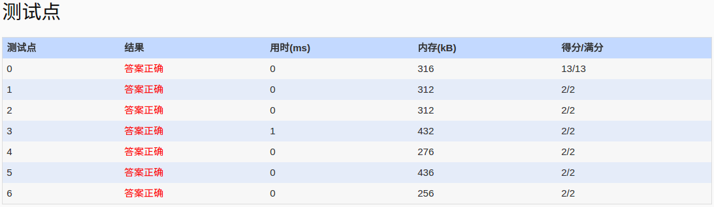

##PAT_A 1040. Longest Symmetric String (25)
	Given a string, you are supposed to output the length of the longest symmetric sub-string. For example, given "Is PAT&TAP symmetric?", the longest symmetric sub-string is "s PAT&TAP s", hence you must output 11.

	Input Specification:

	Each input file contains one test case which gives a non-empty string of length no more than 1000.

	Output Specification:

	For each test case, simply print the maximum length in a line.

	Sample Input:
	Is PAT&TAP symmetric?
	Sample Output:
	11
	
- 分析：
	  寻找最大对称子串，方法：1.确定对称中心　2.从中心开始向外扩展，计算长度 3.在所有对称子串中选择长度最大的。
- code:

```language
#include<iostream>
#include<cstdio>
using namespace std;
int longestStr(string &str,int i,int j,int size)
{
	while(i>=0&&j<size&&str[i]==str[j])
	{
		i--;
		j++;
	}
	return j-i+1-2;
}
int main()
{
	freopen("in","r",stdin);
	string str;
	getline(cin,str);
	int longest=0;
	int tmp=1;//这就有点坑，该字符串symmetric string length>=1
	int tmp1=1;//如　A:1 AB:1 AA:2 BAAAB:5
	int strSize=str.length();
	//定点-扩展
	for(int i=0;i<strSize;i++)
	{
		//must detect in same time,一开始if-else,造成AAA型丢失奇数对称的情况
		if(i+1<strSize&&str[i]==str[i+1])
			tmp1=longestStr(str,i,i+1,strSize);
		if(i+2<strSize&&str[i]==str[i+2])
			tmp=longestStr(str,i,i+2,strSize);
		tmp=tmp>tmp1?tmp:tmp1;
		longest=tmp>longest?tmp:longest;
	}
	cout<<longest<<endl;
	return 0;
}
```
- AC

