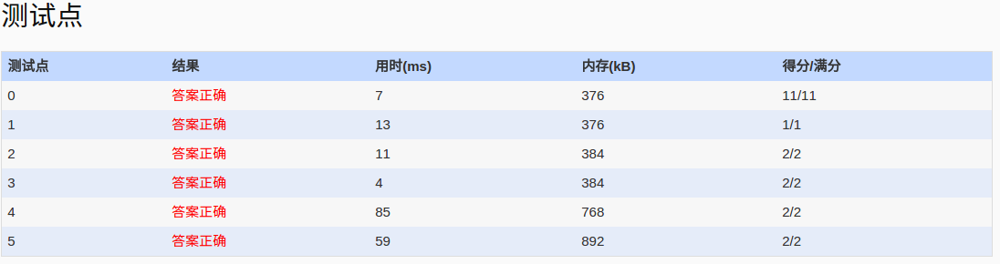

##1041. Be Unique (20)
	时间限制 100 ms 内存限制 65536 kB
	Being unique is so important to people on Mars that even their lottery is designed in a unique way. The rule of winning is simple: one bets on a number chosen from [1, 104]. The first one who bets on a unique number wins. For example, if there are 7 people betting on 5 31 5 88 67 88 17, then the second one who bets on 31 wins.

	Input Specification:

	Each input file contains one test case. Each case contains a line which begins with a positive integer N (<=10^5) and then followed by N bets. The numbers are separated by a space.

	Output Specification:

	For each test case, print the winning number in a line. If there is no winner, print "None" instead.

	Sample Input 1:
	7 5 31 5 88 67 88 17
	Sample Output 1:
	31
	Sample Input 2:
	5 888 666 666 888 888
	Sample Output 2:
	None
- 分析：
	-  这题要求，找出最先出现的那个数，且出现一次。时间限制100ms，数据最大10^5,写完程序，担心超时，好比t1039。索性没有太多要求，一次AC。
	- 方法：利用stl的map+vector完成，map用来完成重复数据计算，vector用来标识数据次序。最后按vector先后顺序，查找第一个map中value=1的key,即是。
	
- code:

```language
#include<iostream>
#include<cstdio>
#include<map>
#include<vector>
using namespace std;
map<int,int> people;
vector<int> seq;
int main()
{
	freopen("in","r",stdin);
	int N,tmp;
	cin>>N;
	for(int i=0;i<N;i++)
	{
		cin>>tmp;
		if(people[tmp]==0)
		  seq.push_back(tmp);
		people[tmp]++;
	}
	int i=0;
	int size=seq.size();
	for(i=0;i<size;i++)
	{
		if(people[seq[i]]==1)
		{
		  cout<<seq[i]<<endl;
		  break;
		}
	}
	if(i==size)
	  cout<<"None"<<endl;
	return 0;
}
```
- AC

