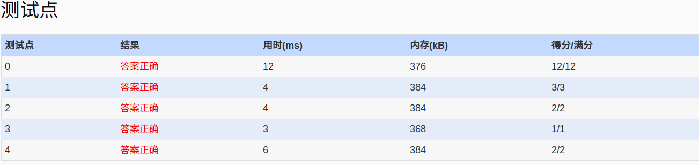

##PAT_A 1042. Shuffling Machine (20)
	Shuffling is a procedure used to randomize a deck of playing cards. Because standard shuffling techniques are seen as weak, and in order to avoid "inside jobs" where employees collaborate with gamblers by performing inadequate shuffles, many casinos employ automatic shuffling machines. Your task is to simulate a shuffling machine.

	The machine shuffles a deck of 54 cards according to a given random order and repeats for a given number of times. It is assumed that the initial status of a card deck is in the following order:

	S1, S2, ..., S13, H1, H2, ..., H13, C1, C2, ..., C13, D1, D2, ..., D13, J1, J2

	where "S" stands for "Spade", "H" for "Heart", "C" for "Club", "D" for "Diamond", and "J" for "Joker". A given order is a permutation of distinct integers in [1, 54]. If the number at the i-th position is j, it means to move the card from position i to position j. For example, suppose we only have 5 cards: S3, H5, C1, D13 and J2. Given a shuffling order {4, 2, 5, 3, 1}, the result will be: J2, H5, D13, S3, C1. If we are to repeat the shuffling again, the result will be: C1, H5, S3, J2, D13.

	Input Specification:

	Each input file contains one test case. For each case, the first line contains a positive integer K (<= 20) which is the number of repeat times. Then the next line contains the given order. All the numbers in a line are separated by a space.

	Output Specification:

	For each test case, print the shuffling results in one line. All the cards are separated by a space, and there must be no extra space at the end of the line.


	Sample Input:
	2
	36 52 37 38 3 39 40 53 54 41 11 12 13 42 43 44 2 4 23 24 25 26 27 6 7 8 48 49 50 51 9 10 14 15 16 5 17 18 19 1 20 21 22 28 29 30 31 32 33 34 35 45 46 47
	
	Sample Output:
	S7 C11 C10 C12 S1 H7 H8 H9 D8 D9 S11 S12 S13 D10 D11 D12 S3 S4 S6 S10 H1 H2 C13 D2 D3 D4 H6 H3 D13 J1 J2 C1 C2 C3 C4 D1 S5 H5 H11 H12 C6 C7 C8 C9 S2 S8 S9 H10 D5 D6 D7 H4 H13 C5

- 分析：
	- 这是一道“神烦”的题目，主要是初始数据的输入。题意，按照给定的次序进行排序，第i个数j,表示第i个数在排序后第j个位置。题目会要求多次排序，输出最后的序列即可。
- code:
```language
#include<iostream>
#include<cstdio>
#include<cstring>
#include<vector>
#include<algorithm>
using namespace std;
struct pairs
{
	char val[4];
	int seq;
};
bool comp(pairs a,pairs b)
{
	return a.seq<b.seq;
}
vector<pairs>cards;
void _init(int base,int size,char A)
{
	int i=base;
	for(int j=1;j<=size;i++,j++)
	{
		cards[i].val[0]=A;
		if(j<10)
			cards[i].val[1]=char('0'+j);
		else
		{
			cards[i].val[1]='1';
			cards[i].val[2]=char('0'+j%10);
		}
	}
}
void init()
{
	pairs tmp;
	tmp.val[2]='\0';
	tmp.val[3]='\0';
	cards.assign(54,tmp);

	_init(0,13,'S');
	_init(13,13,'H');
	_init(26,13,'C');
	_init(39,13,'D');
	_init(52,2,'J');
}
vector<int>seq;
int main()
{
	int N,tmp;
	freopen("in","r",stdin);
	init();
	cin>>N;

	for(int i=0;i<54;i++)
	{
		cin>>tmp;
		seq.push_back(tmp);
	}

	for(int j=0;j<N;j++)
	{
		for(int i=0;i<54;i++)
		{
			cards[i].seq=seq[i];
		}
		sort(cards.begin(),cards.end(),comp);
	}
	int i=0;
	for(i=0;i<cards.size()-1;i++)
	{
		cout<<cards[i].val<<" ";
	}
	cout<<cards[i].val<<endl;
	return 0;
}
```

- AC
  