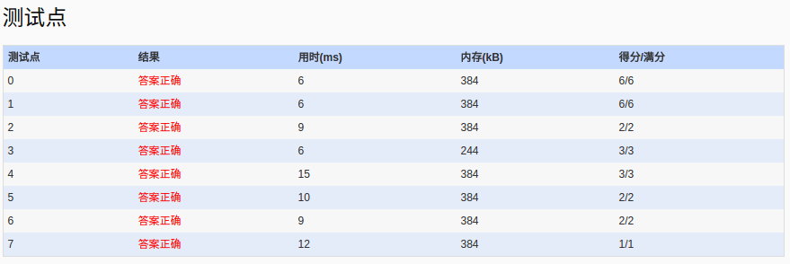

##1043. Is It a Binary Search Tree (25)

	A Binary Search Tree (BST) is recursively defined as a binary tree which has the following properties:

	The left subtree of a node contains only nodes with keys less than the node's key.
	The right subtree of a node contains only nodes with keys greater than or equal to the node's key.
	Both the left and right subtrees must also be binary search trees.
	If we swap the left and right subtrees of every node, then the resulting tree is called the Mirror Image of a BST.

	Now given a sequence of integer keys, you are supposed to tell if it is the preorder traversal sequence of a BST or the mirror image of a BST.

	Input Specification:

	Each input file contains one test case. For each case, the first line contains a positive integer N (<=1000). Then N integer keys are given in the next line. All the numbers in a line are separated by a space.

	Output Specification:

	For each test case, first print in a line "YES" if the sequence is the preorder traversal sequence of a BST or the mirror image of a BST, or "NO" if not. Then if the answer is "YES", print in the next line the postorder traversal sequence of that tree. All the numbers in a line must be separated by a space, and there must be no extra space at the end of the line.

	Sample Input 1:
	7
	8 6 5 7 10 8 11
	Sample Output 1:
	YES
	5 7 6 8 11 10 8
	Sample Input 2:
	7
	8 10 11 8 6 7 5
	Sample Output 2:
	YES
	11 8 10 7 5 6 8
	Sample Input 3:
	7
	8 6 8 5 10 9 11
	Sample Output 3:
	NO
	
- 分析：
  - 该题目考察二叉排序树，先序后序遍历。加上一个BST的镜像步骤增加难度。
  - 解决：１，构建BST 2,判断先序序列是否是一个正确的二叉树，即对BST先序遍历和输入序列比较　３，判断是否是BST的镜像序列，即对BST按 NRL先序方式遍历，对遍历得到的序列和输入序列比较　４，若是BST则进行后序遍历并输出。
  - 之前尝试的方式，在构建BST时，进行判断是否是BST or it`s Mirror,但最终弄得够乱，放弃。
  - 关于构建树的树根传入问题:使用指针引用Tree*&root,这样可通过参数传出树根指针，而不是指针指向的内容。
  - 提交代码后，出现一个case段错误，最终发现是构建树时，子树忘记赋初值NULL,但为什么只出现了一个case段错误呢？不明白～
- code:

```language

#include<iostream>
#include<vector>
#include<cstdio>
using namespace std;
struct Node
{
	int val;
	Node*l;
	Node*r;
};
void build(Node*&t,int val)
{
	if(t==NULL)
	{
		t=new Node;
		t->val=val;
		t->l=t->r=NULL;//第一次提交忘了NULL，即t->l=t->r,最终发生了一个case段错误，为什么只有一个段错误？
	    return;
	}
	if(val<t->val)
	  build(t->l,val);
	else
	  build(t->r,val);
}
void traverse(Node*t,vector<int>&a)
{
	if(t==NULL)
	  return;
	a.push_back(t->val);
	traverse(t->l,a);
	traverse(t->r,a);
}
void traverse_mirror(Node*t,vector<int>&a)
{
	if(t==NULL)
	  return;
	a.push_back(t->val);
	traverse_mirror(t->r,a);
	traverse_mirror(t->l,a);
}
bool isBST(Node*&t,vector<int>&a,bool &isMirror)
{
	for(int i=0;i<a.size();i++)
	  build(t,a[i]);
	vector<int>b;
	traverse(t,b);
	int i=0;
	for(i=0;i<b.size();i++)
	{
		if(a[i]!=b[i])
		  break;
	}
	if(i==b.size())//succeed
	{
	  isMirror=false;
	  return true;
	}
	else
	{
		b.clear();
		traverse_mirror(t,b);
		for(i=0;i<b.size();i++)
		{
			if(a[i]!=b[i])
			  break;
		}
		if(i==b.size())//succeed
		{
			isMirror=true;
		    return true;
		}
	}
	return false;
}
void show(Node *t,bool isMirror=false,bool isRoot=false)
{
	if(t==NULL)
	  return ;
	if(isMirror==false)
	{
		show(t->l,isMirror);
		show(t->r,isMirror);
	}else
	{
		show(t->r,isMirror);
		show(t->l,isMirror);
	}
	cout<<t->val;
	if(!isRoot)
	  cout<<" ";
	else
	  cout<<endl;
}
int main()
{
	freopen("in","r",stdin);
	int N,tmp;
	bool isMirror=false;
	vector<int>pre;
	cin>>N;
	for(int i=0;i<N;i++)
	{
		cin>>tmp;
		pre.push_back(tmp);
	}
	Node*t=NULL;
	if(isBST(t,pre,isMirror)==false)
	  cout<<"NO"<<endl;
	else
	{
		cout<<"YES"<<endl;
		show(t,isMirror,true);
	}
	return 0;
}

```
- AC:
 
