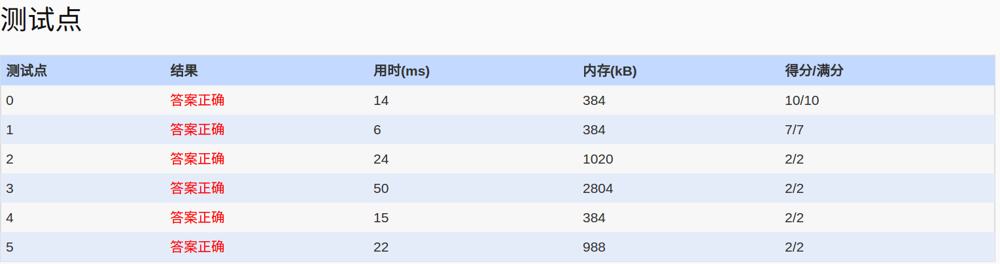

##1044. Shopping in Mars (25)

	Shopping in Mars is quite a different experience. The Mars people pay by chained diamonds. Each diamond has a value (in Mars dollars M$). When making the payment, the chain can be cut at any position for only once and some of the diamonds are taken off the chain one by one. Once a diamond is off the chain, it cannot be taken back. For example, if we have a chain of 8 diamonds with values M$3, 2, 1, 5, 4, 6, 8, 7, and we must pay M$15. We may have 3 options:

	1. Cut the chain between 4 and 6, and take off the diamonds from the position 1 to 5 (with values 3+2+1+5+4=15).
	2. Cut before 5 or after 6, and take off the diamonds from the position 4 to 6 (with values 5+4+6=15).
	3. Cut before 8, and take off the diamonds from the position 7 to 8 (with values 8+7=15).
	Now given the chain of diamond values and the amount that a customer has to pay, you are supposed to list all the paying options for the customer.

	If it is impossible to pay the exact amount, you must suggest solutions with minimum lost.

	Input Specification:

	Each input file contains one test case. For each case, the first line contains 2 numbers: N (<=105), the total number of diamonds on the chain, and M (<=108), the amount that the customer has to pay. Then the next line contains N positive numbers D1 ... DN (Di<=103 for all i=1, ..., N) which are the values of the diamonds. All the numbers in a line are separated by a space.

	Output Specification:

	For each test case, print "i-j" in a line for each pair of i <= j such that Di + ... + Dj = M. Note that if there are more than one solution, all the solutions must be printed in increasing order of i.

	If there is no solution, output "i-j" for pairs of i <= j such that Di + ... + Dj > M with (Di + ... + Dj - M) minimized. Again all the solutions must be printed in increasing order of i.

	It is guaranteed that the total value of diamonds is sufficient to pay the given amount.

	Sample Input 1:
	16 15
	3 2 1 5 4 6 8 7 16 10 15 11 9 12 14 13
	Sample Output 1:
	1-5
	4-6
	7-8
	11-11
	Sample Input 2:
	5 13
	2 4 5 7 9
	Sample Output 2:
	2-4
	4-5
	
- 分析：
  - 题意:在一串数字上，找到连续的几个数，使和S==M;如果没有S==M,则找S>M且min(S-M)
  - 解决思虑：
    - 双层循环，外层负责遍历的首个数，内层负责找到最后一个数，使S满足要求。O(n^2)
	- 改进双层循环，内层循环没有必要一直从i->n,遍历计算。外层移动仅仅需要减去chain[i]即可，内层移动仅需要加上
chain[j]即可，原来的i->j的内层求和是可优化的。现在有一下两种情况：
	 １，chain[i]>=chain[j]:sum[i->j-1]<M,sum[i->j]>=M ;chain[i]>=chain[j] =>sum[i+1->j]<M,需要j+1,接着内层求和，不必从i+1开始。
	 ２，chain[i]<chain[j]:sum[i->j-1]<M,sum[i->j]>M;chain[i]<chain[j]=>有可能sum[i+1->j]<M,所以从j开始判断是否满足。
	 O(n)
    - 二分法，这是看别人的算法，写的很漂亮。外层仍然是循环N次,内层采用二分法定位，这要求输入是记录的是递增sum和。
	O(nlogn)
  - 关于超时：双层循环可AC,但使用的是cin,cout致使改进循环法也超时，替换曾scanf,printf全部AC
  
- code1：双层循环

```c++
#include<iostream>
#include<vector>
#include<cstdio>
using namespace std;
int main()
{
	//freopen("in","r",stdin);
	int N,M,min=0,tmp;
	vector<int> chain;
	scanf("%d%d",&N,&M);//别用cin cout，会超时
	for(int i=0;i<N;i++)
	{
		scanf("%d",&tmp);
		chain.push_back(tmp);
		min+=tmp;
	}
	vector<int>pay;
	int i,j;
	for(int i=0;i<N;i++)
	{
		tmp=0;
		j=0;
		for( j=i;j<N;j++)
		{
			if(tmp>=M)
			  break;
			tmp+=chain[j];
		}
		if(tmp<M)
		  break;
		if(tmp<min)//找到更合适的啦，清空之前的记录
		  pay.clear();
		else if(tmp>min)//记录中比刚发现的要好，不记录
		  continue;
	    pay.push_back(i+1);
	    pay.push_back(j);
		min=tmp;
	}
	for(int i=0;i<pay.size();i+=2)
	  printf("%d-%d\n",pay[i],pay[i+1]);
	return 0;
}
```

- code2：改进循环

```c++
#include<iostream>
#include<vector>
#include<cstdio>
using namespace std;
int main()
{
	freopen("in","r",stdin);
	int N,M,min=0,tmp;
	vector<int> chain;
	//cin>>N>>M;
	scanf("%d%d",&N,&M);
	for(int i=0;i<N;i++)
	{
		//cin>>tmp;
		scanf("%d",&tmp);
		chain.push_back(tmp);
		min+=tmp;
	}
	vector<int>pay;
	int i=0,j=0;
	int pre=0;
	tmp=0;
	//再找到一组i~j满足后，继续寻找i+1,直接j或j+1,
    //这样基本上一个N，O(n)
	for(i=0;i<N;i++)
	{
		tmp-=pre;
		for( ;j<N;j++)
		{
			if(tmp>=M)
			  break;
			tmp+=chain[j];
		}
		j-=1;//注意
		if(tmp<M)
		  break;
		if(tmp<=min)
		{
		  if(tmp<min)//找到更合适的啦，清空之前的记录
			pay.clear();
	      pay.push_back(i+1);
	      pay.push_back(j+1);
		  min=tmp;
		}
		//能够下来说明：找到一组sum[i~j]>=M;
		//**********************************************************************
		//为避免内部循环，可通过仅仅判断chain[i]和chain[j]的大小判断sum[i+1~j]>=M
		//有chain[i~j-1]<M
		//有如下情况：
		//１，chain[i]>=chain[j],下次循环，减去chain[i],则一定sum[i+1~j]<M。
		//	这时，需要判断是否sum[i+1~j+1]>=M,搜索下去知道>=M
		//２，chain[i]<chain[j],下次循环，减去chain[i],则有可能sum[i+1~j]>=M。
		//  这时j,不需要+1,直接进行不断，不满足则继续内层循环即可。
		//通过1,2降低了内层循环次数，原来需要进行N次内循环，现在一次完整的内循环即可。
		//*********************************************************************
		//
		if(chain[i]>=chain[j])//说明sum(i+1~j)<M,
		  j++;
		else
	        tmp-=chain[j];
	}
	for(int i=0;i<pay.size();i+=2)
	  printf("%d-%d\n",pay[i],pay[i+1]);
	  //cout<<pay[i]<<"-"<<pay[i+1]<<endl;//千万不要用cout ,cin可能会超时
	return 0;
}
```
- code3：二分法 [柳婼 の blog](https://www.liuchuo.net/archives/2939)
- AC

  