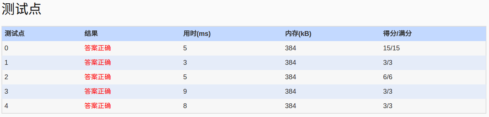

##1045. Favorite Color Stripe (30)

	Eva is trying to make her own color stripe out of a given one. She would like to keep only her favorite colors in her favorite order by cutting off those unwanted pieces and sewing the remaining parts together to form her favorite color stripe.

	It is said that a normal human eye can distinguish about less than 200 different colors, so Eva's favorite colors are limited. However the original stripe could be very long, and Eva would like to have the remaining favorite stripe with the maximum length. So she needs your help to find her the best result.

	Note that the solution might not be unique, but you only have to tell her the maximum length. For example, given a stripe of colors {2 2 4 1 5 5 6 3 1 1 5 6}. If Eva's favorite colors are given in her favorite order as {2 3 1 5 6}, then she has 4 possible best solutions {2 2 1 1 1 5 6}, {2 2 1 5 5 5 6}, {2 2 1 5 5 6 6}, and {2 2 3 1 1 5 6}.

	Input Specification:

	Each input file contains one test case. For each case, the first line contains a positive integer N (<=200) which is the total number of colors involved (and hence the colors are numbered from 1 to N). Then the next line starts with a positive integer M (<=200) followed by M Eva's favorite color numbers given in her favorite order. Finally the third line starts with a positive integer L (<=10000) which is the length of the given stripe, followed by L colors on the stripe. All the numbers in a line are separated by a space.

	Output Specification:

	For each test case, simply print in a line the maximum length of Eva's favorite stripe.

	Sample Input:
	6
	5 2 3 1 5 6
	12 2 2 4 1 5 5 6 3 1 1 5 6
	Sample Output:
	7
- 分析：
  - 题目要求：给出一个喜欢颜色序列，按照这个喜欢序列从所有的条纹中,去除不喜欢的条纹,使喜欢的条纹连在一起最大,给出最大color数即可（算重复）；喜欢序列不必全部使用上。如题目所给示例：best solutions {2 2 1 1 1 5 6}, {2 2 1 5 5 5 6}, {2 2 1 5 5 6 6}, and {2 2 3 1 1 5 6} =>7
  - 解题：最开始看到题目，蒙了，不知道从何下手。过了三天，发现仅通过计数技能解决，输出只要求最大序列的元素个数，这要简单点，对于每个序列中我们可以递增计数(最长不下降子序列)，从1 2 3 4 5...，从所有序列看，是对前边favor序列中最大的计数＋１更新当前访问color的计数，这样遍历结束。计数中最大的记录便是是输出，同时逆序递减１的元素组成的序列便是possible best solutions(有点动态规划的意思)
  - 涉及：hash数组通过color确定计数数组地址；访问计数更新
  - code:
  
```language
#include<iostream>
#include<cstdio>
#include<vector>
using namespace std;
vector<int>favor_count;
int toAds[220];//address by hash
/*
解决思路：favor进行hash映射及toAds，获得的地址为存储favor_count计数的数组下标
	顺序访问strips, 对于第i次访问，从(i~0)查找favor_j的计数数组，进行比较，若
	>=则favor_count[i]=favor_count[j]+1;
	最后找出favor_count中最大的计数即可
 */
int count(int pos)
{
	int cur=toAds[pos];
	int max=favor_count[cur];
	for(int i=cur;i>=0;i--)
	{
		if(favor_count[cur]<=favor_count[i])
		  favor_count[cur]=favor_count[i]+1;
		if(max<favor_count[cur])
		  max=favor_count[cur];
	}
	return max;
}
int main()
{
	freopen("in","r",stdin);
	fill_n(toAds,220,-1);
	int N=0,M=0,L=0;
	int tmp=0;
	scanf("%d%d",&N,&M);
	favor_count.assign(M,0);
	for(int i=0;i<M;i++)
	{
		scanf("%d",&tmp);
		toAds[tmp]=i;
	}
	scanf("%d",&L);
	int max=0;
	for(int i=0;i<L;i++)
	{
		scanf("%d",&tmp);
		if(toAds[tmp]>=0)
		{
		  tmp=count(tmp);
		  if(max<tmp)
			max=tmp;
		}
	}
	printf("%d\n",max);
	return 0;
}

```
- 其他解法:最长公共子序列
  - [柳婼 の blog 1045. Favorite Color Stripe (30)-PAT甲级真题](https://www.liuchuo.net/archives/2283)
  - [PAT 解题报告 1045. Favorite Color Stripe (30)](https://www.sigmainfy.com/blog/pat-1045-favorite-color-stripe.html)
  - [1045. Favorite Color Stripe (30) -LCS允许元素重复](http://blog.csdn.net/xyt8023y/article/details/46910283)
- AC
