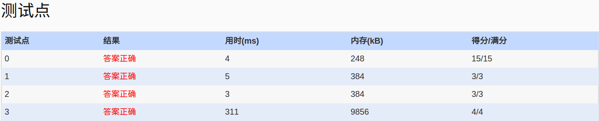

##1047. Student List for Course (25)

	Zhejiang University has 40000 students and provides 2500 courses. Now given the registered
	course list of each student, you are supposed to output the student name lists of all the 
	courses.

	Input Specification:

	Each input file contains one test case. For each case, the first line contains 2 numbers: N 
	(<=40000), the total number of students, and K (<=2500), the total number of courses. Then N
	lines follow, each contains a student's name (3 capital English letters plus a one-digit
	number), a positive number C (<=20) which is the number of courses that this student has 
	registered, and then followed by C course numbers. For the sake of simplicity, the courses 
	are numbered from 1 to K.

	Output Specification:

	For each test case, print the student name lists of all the courses in increasing order of 
	the course numbers. For each course, first print in one line the course number and the 
	number of registered students, separated by a space. Then output the students' names in 
	alphabetical order. Each name occupies a line.

	Sample Input:
	
	10 5
	ZOE1 2 4 5
	ANN0 3 5 2 1
	BOB5 5 3 4 2 1 5
	JOE4 1 2
	JAY9 4 1 2 5 4
	FRA8 3 4 2 5
	DON2 2 4 5
	AMY7 1 5
	KAT3 3 5 4 2
	LOR6 4 2 4 1 5
	
	Sample Output:
	
	1 4
	ANN0
	BOB5
	JAY9
	LOR6
	2 7
	ANN0
	BOB5
	FRA8
	JAY9
	JOE4
	KAT3
	LOR6
	3 1
	BOB5
	4 7
	BOB5
	DON2
	FRA8
	JAY9
	KAT3
	LOR6
	ZOE1
	5 9
	AMY7
	ANN0
	BOB5
	DON2
	FRA8
	JAY9
	KAT3
	LOR6
	ZOE1
	
- 分析：
　　- 题目：给定格式化的人名ABC0,和课号(1-N),给出选课情况，升序输出每个课程的选课人名(升序)。
　　- 利用stl的sort排序完成，但string的排序太慢，导致最后的测试点超时。故改变思路，string to int
　　  中间用数字表示人名，排完序后，再转换回来,这样人名排序就是数字的比较。
- code:
 
```language
#include<iostream>
#include<vector>
#include<cstdio>
#include<algorithm>
using namespace std;
int nameToNum(string name)
{
	int num=(name[0]-'A');//懒得写循环了，之前是写的循环
	num*=26;
	num+=(name[1]-'A');
	num*=26;
	num+=(name[2]-'A');
	num*=26;
	num+=(name[3]-'0');
	return num;
}
string numToName(int n)
{
	char tmp[5];
	tmp[4]='\0';
	tmp[3]=char(n%26+'0');
	n/=26;
	tmp[2]=char(n%26+'A');
	n/=26;
	tmp[1]=char(n%26+'A');
	n/=26;
	tmp[0]=char(n%26+'A');
	return tmp;
}
vector<int> course[2550];
int main()
{
	freopen("in","r",stdin);
	int N,K,C,tmp,iname;
	char name[5];
	scanf("%d%d",&N,&K);
	for(int i=0;i<N;i++)
	{
		scanf("%s%d",name,&C);
		iname=nameToNum(name);
		for(int j=0;j<C;j++)
		{
			scanf("%d",&tmp);
			course[tmp].push_back(iname);
		}
	}
	int size=0;
	string sname;
	for(int i=1;i<=K;i++)
	{
		size=course[i].size();
		printf("%d %d\n",i,size);
		sort(course[i].begin(),course[i].end());
		for(int j=0;j<course[i].size();j++)
		{
			sname=numToName(course[i][j]);
			printf("%s\n",sname.c_str());
		}
	}
	return 0;
}
```

- AC
