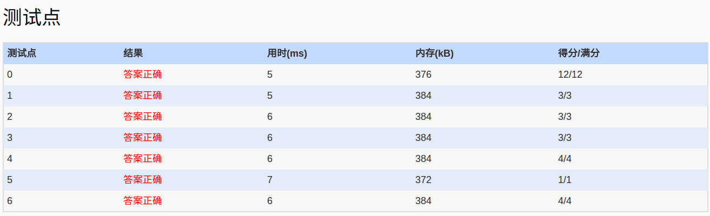

##1049. Counting Ones (30)

	The task is simple: given any positive integer N, you are supposed to count the total number 
	of 1's in the decimal form of the integers from 1 to N. For example, given N being 12, there 
	are five 1's in 1, 10, 11, and 12.

	Input Specification:

	Each input file contains one test case which gives the positive N (<=230).

	Output Specification:

	For each test case, print the number of 1's in one line.

	Sample Input:
	12
	Sample Output:
	5

- 分析：
  - 找规律啊：
    - 分为：i位1的个数和i-1位上１的个数
	    - i-1位：
			- 对于整的部分，如249有2个d(0,99) ,d对于(0,9)有1个１,(0,99)有20个１，(0,999)有300个１,...
			- 对于不够凑整的部分，只需利用上一次的计算结果即可,如249,的49部分利用第2次的计算结果即可
	    - i位：
			- i位上为0，则没有i位上的1
			- i位上为1,如149中1xx形式，i位上有1+49个1 <<注意 1,0
		    - i位上大于1,如249中1xx形式，i位上有pow(10,i-1)个1 
	- 规律找的头疼啊~
  
- code:

```c++
	#include<iostream>
	#include<cstdio>
	#include<cmath>
	int digits[20];
	using namespace std;
	int main()
	{
		unsigned int N;
		cin>>N;
		fill_n(digits,20,1);
		int i=1;
		int sum=0;
		int pre=0;//N的i-1~0位的数
		int d=0;//记录(0,10) (0,100) (0,1000) ...下的完整１的个数
		while(N)
		{
			digits[i]=N%10+1;
			//sum中便记录着非整i位的1计数
			//i-1位
			//digits[i]-1个完整的i-1位1
			//1.sum本身记录着前i-1位1的个数，如149，当前sum中记录着49中的1的个数
			//2.digits[i]-1个完整i-1位1的个数，如249，含有3*20个1, (0~99)中含20个1
			sum+=(digits[i]-1)*d;

			//第i位 249 中1xx有i位1的计数为1+99个
			if(digits[i]>2)//1xxx　xxx个i位1
				sum+=pow(10,i-1);
			//149,则仅有第三位1的个数为1+49个
			if(digits[i]==2)//1pre pre个i位的1
				sum+=(pre+1);

			pre=pre+(digits[i]-1)*pow(10,i-1);//N的i位构成的数字
			d=10*d+pow(10,i-1);//记录(0,9) (0,99) (0,999) ...1的个数
			N/=10;
			i++;
		}
		cout<<sum<<endl;
		return 0;
	}
```

- AC
