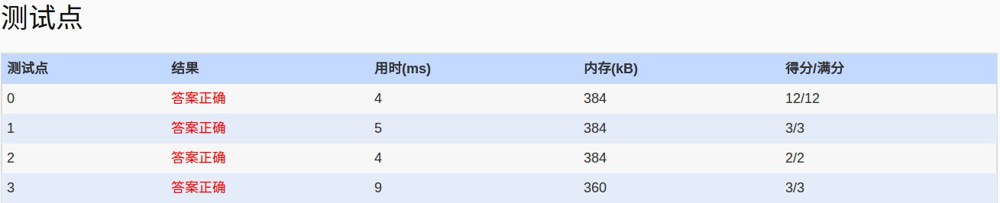

##1050. String Subtraction (20)

	Given two strings S1 and S2, S = S1 - S2 is defined to be the remaining string after taking
	all the characters in S2 from S1. Your task is simply to calculate S1 - S2 for any given
	strings. However, it might not be that simple to do it fast.

	Input Specification:

	Each input file contains one test case. Each case consists of two lines which gives S1 and 
	S2, respectively. The string lengths of both strings are no more than 104. It is guaranteed 
	that all the characters are visible ASCII codes and white space, and a new line character 
	signals the end of a string.

	Output Specification:

	For each test case, print S1 - S2 in one line.

	Sample Input:
	They are students.
	aeiou
	Sample Output:
	Thy r stdnts.
	
- 分析：
  - 题目：输出在s1中的字符，但不在s2中的字符
  - 解题：利用hash，对s2中的字符做个存在标识，s1输出中，检查标识，不存在2中则输出
  
- code:
```language
#include<iostream>
#include<cstdio>
using namespace std;
int s[500];
int main()
{
	freopen("in","r",stdin);
	string s1,s2;
	fill_n(s,0,500);
	getline(cin,s1);
	getline(cin,s2);
	for(int i=0;i<s2.length();i++)
		s[int(s2[i])]=1;
	for(int i=0;i<s1.length();i++)
	{
		if(s[int(s1[i])]==0)
		  cout<<s1[i];
	}
	cout<<endl;
	return 0;
}
```

- AC:
