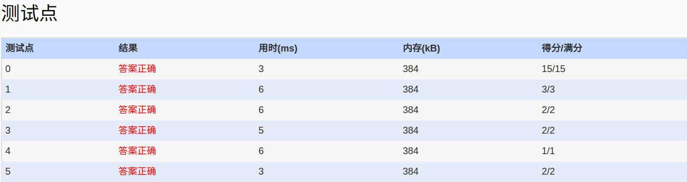

##1051. Pop Sequence (25)

	Given a stack which can keep M numbers at most. Push N numbers in the order of 1, 2, 3, ...,
	N and pop randomly. You are supposed to tell if a given sequence of numbers is a possible 
	pop sequence of the stack. For example, if M is 5 and N is 7, we can obtain 1, 2, 3, 4, 5,
	6, 7 from the stack, but not 3, 2, 1, 7, 5, 6, 4.

	Input Specification:

	Each input file contains one test case. For each case, the first line contains 3 numbers 
	(all no more than 1000): M (the maximum capacity of the stack), N (the length of push
	sequence), and K (the number of pop sequences to be checked). Then K lines follow, each
	contains a pop sequence of N numbers. All the numbers in a line are separated by a space.

	Output Specification:

	For each pop sequence, print in one line "YES" if it is indeed a possible pop sequence of
	the stack, or "NO" if not.

	Sample Input:
	5 7 5
	1 2 3 4 5 6 7
	3 2 1 7 5 6 4
	7 6 5 4 3 2 1
	5 6 4 3 7 2 1
	1 7 6 5 4 3 2
	Sample Output:
	YES
	NO
	NO
	YES
	NO
	
- 分析：
  - 题目：检查所给序列是否是正确的栈push pop序列。
  - 解题：这个我们通过观察，可以发现对于每次的每次pop之后如果发生push就会形成一个明显的片段序列。规律是这样的:1,不发生push的pop是非增序列 ai,ai+1,ai+2,...an;2,一但发生push(bk)，在pop就会形成比前一个序列大的元素 bk,并且bk 之间是增长关系。如5 6 4 3 7 2 1,可以看出在5 6 7 之前分别进行了push(push 1 2 3 4 5 pop 5,push 6 ,pop 6 4 3,push 7,pop 7 2 1),

- code:

```language
#include<iostream>
#include<cstdio>
using namespace std;

int seq[1010];
int main()
{
	freopen("in","r",stdin);
	int M,N,K,tmp,count,pre,split,isRight;
	scanf("%d%d%d",&M,&N,&K);
	for(int i=0;i<K;i++)
	{
		pre=split=0;
		isRight=1;
		for(int j=0;j<N;j++)
		{
		  scanf("%d",&tmp);
		  if(tmp>pre)//新的划分
		  {
			if(tmp<split)//划分值非递增,非法
				isRight=0;
			split=tmp;
			count=1;
		  }else
			count++;
		  if(count>M)//超过栈的容量
		    isRight=0;
		  pre=tmp;
		}
		if(isRight==0)
		  printf("NO\n");
		else
		  printf("YES\n");
	}
	return 0;
}
```

- AC

  