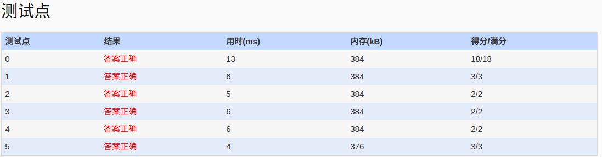

##1053. Path of Equal Weight (30)

	Given a non-empty tree with root R, and with weight Wi assigned to each tree node Ti. The
	weight of a path from R to L is defined to be the sum of the weights of all the nodes along
	the path from R to any leaf node L.

	Now given any weighted tree, you are supposed to find all the paths with their weights equal 
	to a given number. For example, let's consider the tree showed in Figure 1: for each node,
	the upper number is the node ID which is a two-digit number, and the lower number is the
	weight of that node. Suppose that the given number is 24, then there exists 4 different 
	paths which have the same given weight: {10 5 2 7}, {10 4 10}, {10 3 3 6 2} and {10 3 3 6
	2}, which correspond to the red edges in Figure 1.


	Figure 1
	Input Specification:

	Each input file contains one test case. Each case starts with a line containing 0 < N <= 
	100, the number of nodes in a tree, M (< N), the number of non-leaf nodes, and 0 < S < 230,
	the given weight number. The next line contains N positive numbers where Wi (<1000) 
	corresponds to the tree node Ti. Then M lines follow, each in the format:

	ID K ID[1] ID[2] ... ID[K]
	where ID is a two-digit number representing a given non-leaf node, K is the number of its
	children, followed by a sequence of two-digit ID's of its children. For the sake of
	simplicity, let us fix the root ID to be 00.

	Output Specification:

	For each test case, print all the paths with weight S in non-increasing order. Each path
	occupies a line with printed weights from the root to the leaf in order. All the numbers 
	must be separated by a space with no extra space at the end of the line.

	Note: sequence {A1, A2, ..., An} is said to be greater than sequence {B1, B2, ..., Bm} if 
	there exists 1 <= k < min{n, m} such that Ai = Bi for i=1, ... k, and Ak+1 > Bk+1.

	Sample Input:
	20 9 24
	10 2 4 3 5 10 2 18 9 7 2 2 1 3 12 1 8 6 2 2
	00 4 01 02 03 04
	02 1 05
	04 2 06 07
	03 3 11 12 13
	06 1 09
	07 2 08 10
	16 1 15
	13 3 14 16 17
	17 2 18 19
	Sample Output:
	10 5 2 7
	10 4 10
	10 3 3 6 2
	10 3 3 6 2
	
- 分析：
  - 题目：
  	- 给定一棵树，每个节点有一个权值，给定一个权值和S,找到所有从根到叶子的权值和为S的路径。
	- 输出要求，不同路径之间要求按非降顺序输出。
	- 考树的构造，遍历。
  - 解题：
    - 先构造这棵树，这里用vector<int> tree[110]表示，vector<int>中记录孩子节点号。每个节点编号对应的权值，
  　  nodeWeight[110]。
    - 由于结果要求非降序输出，故对输入的数据进行预处理使其有序。对于每个节点的还在按权值递增排序存储在
      vector<int>元素中，这样遍历树时有序遍历（从大到小)，到达叶子，满足输出，便是符合排序要求。
	  
- code:

```c++
#include<iostream>
#include<cstdio>
#include<algorithm>
#include<vector>
using namespace std;
int nodeWeight[110];
vector<int> tree[110];
int check[110];
bool comp(int a,int b)
{
	return nodeWeight[a]<nodeWeight[b];
}
//右递归下去
vector<int> seq;
void checkTree(int child,long w,long s,vector<int>& seq)
{
	if(child>=110)return;
	if(w>s)return;
	if(tree[child].size()==0)
	{
		//leaf
		if(w==s)
		{
		  for(int k=0;k<seq.size()-1;k++)
		  {
			  printf("%d ",seq[k]);
		  }
		  printf("%d\n",seq[seq.size()-1]);
		  return;
		}
		return;
	}
	for(int i=tree[child].size()-1;i>=0;i--)
	{
		w+=nodeWeight[tree[child][i]];
		seq.push_back(nodeWeight[tree[child][i]]);
		checkTree(tree[child][i],w,s,seq);
		w-=nodeWeight[tree[child][i]];
		seq.pop_back();
	}
}

int main()
{
	freopen("in","r",stdin);
	fill_n(nodeWeight,110,0);
	fill_n(check,110,0);
	int N,M,tmp;
	long S;
	scanf("%d%d%ld",&N,&M,&S);
	for(int i=0;i<N;i++)
	{
		scanf("%d",&tmp);
		nodeWeight[i]=tmp;
	}
	int count=0;
	int child=0;
	for(int i=0;i<M;i++)
	{
		scanf("%d%d",&tmp,&count);
		for(int j=0;j<count;j++)
		{
			scanf("%d",&child);
			tree[tmp].push_back(child);
		}
		//按w递增
		sort(tree[tmp].begin(),tree[tmp].end(),comp);
	}
	seq.push_back(nodeWeight[0]);
	checkTree(0,nodeWeight[0],S,seq);
	return 0;
}

```

- AC:

	
 