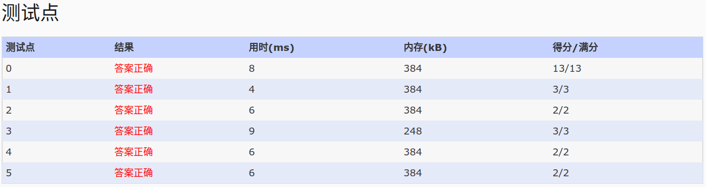

## 1056. Mice and Rice (25)

Mice and Rice is the name of a programming contest in which each programmer must write 
a piece of code to control the movements of a mouse in a given map. The goal of each 
mouse is to eat as much rice as possible in order to become a FatMouse.

First the playing order is randomly decided for NP programmers. Then every NG 
programmers are grouped in a match. The fattest mouse in a group wins and enters the 
next turn. All the losers in this turn are ranked the same. Every NG winners are then 
grouped in the next match until a final winner is determined.

For the sake of simplicity, assume that the weight of each mouse is fixed once the 
programmer submits his/her code. Given the weights of all the mice and the initial 
playing order, you are supposed to output the ranks for the programmers.

Input Specification:

Each input file contains one test case. For each case, the first line contains 2 
positive integers: NP and NG (<= 1000), the number of programmers and the maximum 
number of mice in a group, respectively. If there are less than NG mice at the end of 
the player's list, then all the mice left will be put into the last group. The second 
line contains NP distinct non-negative numbers Wi (i=0,...NP-1) where each Wi is the 
weight of the i-th mouse respectively. The third line gives the initial playing order 
which is a permutation of 0,...NP-1 (assume that the programmers are numbered from 0 
to NP-1). All the numbers in a line are separated by a space.

Output Specification:

For each test case, print the final ranks in a line. The i-th number is the rank of 
the i-th programmer, and all the numbers must be separated by a space, with no extra 
space at the end of the line.

Sample Input:
11 3
25 18 0 46 37 3 19 22 57 56 10
6 0 8 7 10 5 9 1 4 2 3
Sample Output:
5 5 5 2 5 5 5 3 1 3 5

- 分析:根本读不懂这道题写的什么东西!读了很久,终于明白怎么比赛了,但是又不明白怎么没有第四名。
  - 比赛:
    -  按序分组,找出最大的,晋级；未晋级的排名一致。
    - 输入数据所给的第二行是，每只老鼠的重量，每一组进行比大小，的重量都是第二行的数字，不进行叠加，这就是题目中的
    FIX的说明。==>完全头晕啊
    - 关于第三行，第i个人控制的第i个位置上指示的老鼠。==>这是我一开始读不明白的地方
    - 注意比赛排名,第N名前有N-1个人,N-1中可以有同名次人员。这就是为什么会输出中没有第4名,因为排名中，第5名前有
      四个人，但这四个人中有两个同名次(3,3)。
    - [其他分析](http://www.lai18.com/content/10373978.html)


- code:

```
/*************************************************************************
    > Created Time: 2017年09月14日 星期四 17时55分19秒
    1.采用双队列交替记录晋级人员
    2.未晋级排名为晋级栈的大小+1
 ************************************************************************/
    #include<iostream>
    #include<cstdio>
    #include<vector>
    using namespace std;
    int flag[10010];
    int w[10010];
    int r[10010];
    vector<int> va;
    vector<int> vb;
    int main()
    {
        freopen("in","r",stdin);
        int NP,NG;
        int tmp;
        scanf("%d%d",&NP,&NG);
        for(int i=0;i<NP;i++)
            scanf("%d",&w[i]);
        for(int i=0;i<NP;i++)
        {
            scanf("%d",&tmp);
            va.push_back(tmp);
            flag[i]=0;
            r[i]=1;
        }
        int ng=NG;
        int max=0;//组内最大的下标
        //采用双队列,交替跟进,记录晋级人数
        vector<int>*a=&va;
        vector<int>*b=&vb;
        vector<int>*c=a;
        while(a->size()>1)
        {
            ng=NG;
            max=(*a)[0];
            for(int i=0;i<a->size();i++)
            {
                if(w[max]<w[(*a)[i]])
                    max=(*a)[i];
                ng--;
                if(ng==0||i==a->size()-1)//ng控制一组,按照顺序没NG个一组
                {
                    //晋级人员压栈，最终，未晋级人员的排名便是晋级栈的大小+1
                    b->push_back(max);
                    flag[max]=1;//晋级标志,max晋级
                    max=(*a)[i+1];
                    ng=NG;
                }
            }
            for(int i=0;i<a->size();i++)
                if(flag[(*a)[i]]==0)//晋级人数为:b->size(),故未晋级的排名为b->size()+1
                    r[(*a)[i]]=b->size()+1;
                else
                    flag[(*a)[i]]=0;//恢复check值,待下次访问使用
            a->clear();//va
            //交换
            c=b;b=a;a=c;
        }
        for(int i=0;i<NP;i++)
        {
            printf("%d",r[i]);
            if(i==NP-1)
                printf("\n");
            else
                printf(" ");
        }
        return 0;
    }
```
- AC:
