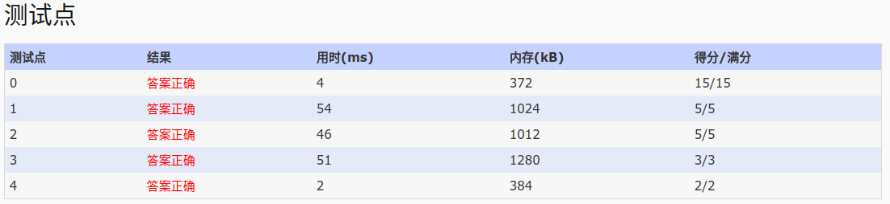

## 1057. Stack (30)
    Stack is one of the most fundamental data structures, which is based on the 
    principle of Last In First Out (LIFO). The basic operations include Push 
    (inserting an element onto the top position) and Pop (deleting the top element). 
    Now you are supposed to implement a stack with an extra operation: PeekMedian -- 
    return the median value of all the elements in the stack. With N elements, the 
    median value is defined to be the (N/2)-th smallest element if N is even, or ((N
    +1)/2)-th if N is odd.

    Input Specification:

    Each input file contains one test case. For each case, the first line contains a 
    positive integer N (<= 105). Then N lines follow, each contains a command in one 
    of the following 3 formats:

    Push key
    Pop
    PeekMedian
    where key is a positive integer no more than 105.

    Output Specification:

    For each Push command, insert key into the stack and output nothing. For each Pop or PeekMedian command, print in a line the corresponding returned value. If the command is invalid, print "Invalid" instead.

    Sample Input:
    17
    Pop
    PeekMedian
    Push 3
    PeekMedian
    Push 2
    PeekMedian
    Push 1
    PeekMedian
    Pop
    Pop
    Push 5
    Push 4
    PeekMedian
    Pop
    Pop
    Pop
    Pop
    Sample Output:
    Invalid
    Invalid
    3
    2
    2
    1
    2
    4
    4
    5
    3
    Invalid

- 分析：这道题挺难得
  - 题目：给站添加一个访问中位数的功能（在一堆乱序的数组中找到中位数,树状数组可在O(n)时间内实现）
  - 解题：今天刚学到的一个方法--树状数组。
    - 具体：push n时，对树状数组n的数值=1,然后累加到后继中。由于数组初始为0，故通过求和可求得前n个元素的和，其和便是其排名。
    - 在中位数时，我们通过上述思想，加上二分搜索定位到目标。
  - 关于树状数组见文末链接

- code:

```
//自己给自己挖了个坑，非要待数组参数的函数，结果最后把数组大小传错
//排错花了特别长时间， ):
#include<iostream>
#include<cstdio>
#include<cstdio>
#include<stack>
using namespace std;
//树状数组
int lowbit(int x){
  return x&(-x);
}
/*
 //这里不用这个
void calStage(int *sum,int n)
{
  int par=0;
  for(int i=1;i+lowbit(i)<=n;i++)
  {
    par=i+lowbit(i);//后继，更新d00..非终端结点
    sum[par]+=sum[i];
  }
}
*/
void update(int *sum,int n,int k,int v)
{
  int par=k;
  while(par<=n)
  {
    sum[par]+=v;
    par+=lowbit(par);
  }
}
int gs(int *sum,int n)
{
  int s=0;
  while(n>0)
  {
    s+=sum[n];
    n=n-lowbit(n);//前驱，求和
  }
  return s;
}

int gRank(int *sum,int imax,int k)
{
  int l=1;int r=imax;
  int m=(l+r)/2;
  while(l<r)
  {
    m=(l+r)/2;
    if(gs(sum,m)>=k)r=m;
    else l=m+1;
  }
  return r;//返回l或者r都可以，但不可以返回m
  //退出二分是，m
}
const int MAX=100010;
int sum[MAX];
stack<int> stk;
int main()
{
  //fill_n(sum,MAX,0);//设置0，可以不写这句，把定义放到静态变量区即可
  freopen("in","r",stdin);
  int N,tmp;
  char op[20];
  scanf("%d",&N);
  for(int i=0;i<N;i++)
  {
    scanf("%s",op);
    switch(op[1])
    {
      case 'u'://push
        scanf("%d",&tmp);
        stk.push(tmp);
        update(sum,MAX,tmp,1);
  
        break;
      case 'o'://pop
        if(stk.size()<=0)
          printf("Invalid\n");
        else
        {
          update(sum,MAX,stk.top(),-1);
          printf("%d\n",stk.top());
          stk.pop();
        }
       break;
      default://'e'  peekMadian
        if(stk.size()<=0)
          printf("Invalid\n");
        else
          //偶数+1/2仍是原来的偶数/2
          printf("%d\n",gRank(sum,MAX,(stk.size()+1)/2));
    }
  }
	return 0;
}

```

- AC:

- 树状数组
  - [维基百科-树状数组](https://zh.wikipedia.org/w/index.php?title=%E6%A0%91%E7%8A%B6%E6%95%B0%E7%BB%84)
  - [天天向上的博客树状数组(Binary Indexed Tree) 总结](http://www.cnblogs.com/xudong-bupt/p/3484080.html)
  - [英雄哪里来 夜深人静写算法（三） - 树状数组](http://www.cppblog.com/menjitianya/archive/2015/11/02/212171.html)
  - [推荐_解法_liunuo的博客](https://www.liuchuo.net/archives/2265)
