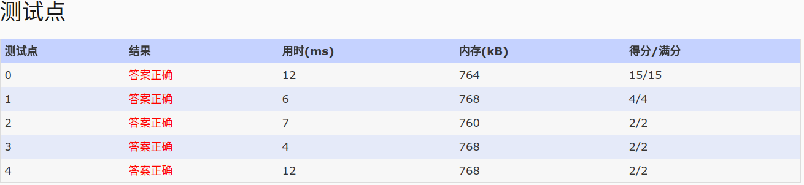

## 1059. Prime Factors (25)


    Given any positive integer N, you are supposed to find all of its prime factors, and write them 
    in the format N = p1^k1 * p2^k2 *…*pm^km.

    Input Specification:

    Each input file contains one test case which gives a positive integer N in the range of long 
    int.

    Output Specification:

    Factor N in the format N = p1^k1 * p2^k2 *…*pm^km, where pi's are prime factors of N in 
    increasing order, and the exponent ki is the number of pi -- hence when there is only one pi, 
    ki is 1 and must NOT be printed out.

    Sample Input:
    97532468
    Sample Output:
    97532468=2^2*11*17*102*1291

- 分析：求解一个数的质因子乘积的形式。
    - 解题：构建质数表。质数筛选法，时间复杂度O(n),还有对对此方法进行优化的。

- code:
    - 质数筛选法
    ```
        const int MAX=100000;
        int prime[MAX];
        //筛选法求质数表
        fill_n(prime,MAX,1);
        for(int i=2;i<MAX;i++)
            for(int j=2;i*j<MAX;j++)
            prime[i*j]=0;


    ```
    - AC code:

    ```
    #include<iostream>
    #include<cstdio>
    using namespace std;
    const int MAX=100000;
    int prime[MAX];
    int main()
    {
    //筛选法求质数表
    fill_n(prime,MAX,1);
    //仅仅求到log(n)的质数表,因为质因数分解不需要对log(n)后边的查表判断
    for(int i=2;i*i<MAX;i++)
        for(int j=2;i*j<MAX;j++)
        prime[i*j]=0;

    long int n;
    scanf("%ld",&n);
    printf("%ld=",n);
    if(n==1)printf("1");
    int cnt=0;
    int b=0;
    for(int i=2;i<=n;i++)
    {
        if(prime[i]==0)continue;
        cnt=0;
        //计算N有几i的乘积
        while(n%i==0)
        {
        cnt++;
        n/=i;
        }
        //一个也没有则，说明这个数不在N的因子中
        if(cnt==0)continue;

        //除第一次外
        if(b==0)b=1;
        else printf("*");

        printf("%d",i);

        //输出i的质数
        if(cnt>1)printf("^%d",cnt);
    }
    printf("\n");
    return 0;
    }
    ```


- AC:

- 参考
[liunuo](https://www.liuchuo.net/archives/2289)