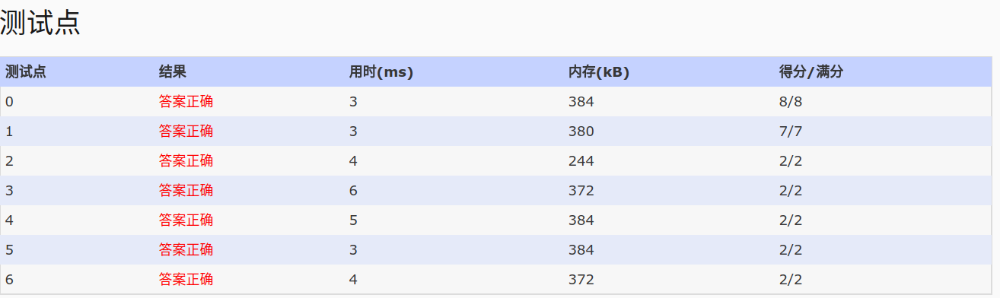

## 1060. Are They Equal (25)

    If a machine can save only 3 significant digits, the float numbers 12300 and 
    12358.9 are considered equal since they are both saved as 0.123*105 with simple chopping. Now 
    given the number of significant digits on a machine and two float numbers, you are supposed to 
    tell if they are treated equal in that machine.

    Input Specification:

    Each input file contains one test case which gives three numbers N, A and B, where N (<100) is 
    the number of significant digits, and A and B are the two float numbers to be compared. Each 
    float number is non-negative, no greater than 10100, and that its total digit number is less than 100.

    Output Specification:

    For each test case, print in a line "YES" if the two numbers are treated equal, and then the 
    number in the standard form "0.d1...dN*10^k" (d1>0 unless the number is 0); or "NO" if they are 
    not treated equal, and then the two numbers in their standard form. All the terms must be 
    separated by a space, with no extra space at the end of a line.

    Note: Simple chopping is assumed without rounding.

    Sample Input 1:
    3 12300 12358.9
    Sample Output 1:
    YES 0.123*10^5
    Sample Input 2:
    3 120 128
    Sample Output 2:
    NO 0.120*10^3 0.128*10^3

- 分析：这道没有什么算法，纯粹就是模拟，要要注意各种情况。
  - 解题：科学表示法，有两部分组成：底数和指数，比较俩个数的大小就是要比较这两个因素的大小。比较指数，我们只需要计算数据的宽度，宽度通过点的位置和第一个非零位置差确定。底数，去掉首部的0和中间的.这样的数我们最后用来底数比较。
  (一开始我认为这道题很简单，于是，并没有明显做成科学数的两部分，而是直接比较，在比较中跳过.，最后漏洞百出，代码混乱)
  - [模拟数据：](https://siukwan.sinaapp.com/?p=381)

    ```
    3 12300 12358.9
    YES 0.123*10^5
    
    1 12300 12358.9
    YES 0.1*10^5
    
    1 1.2300 1.23589
    YES 0.1*10^1
    
    5 1.2300 1.23589
    NO 0.12300*10^1 0.12358*10^1
    
    4 0.01234 0.012345
    YES 0.1234*10^-1
    
    5 0.01234 0.012345
    NO 0.12340*10^-1 0.12345*10^-1
    
    5 0.1234 0.12345
    NO 0.12340*10^0 0.12345*10^0
    
    0 0.11 0
    YES 0.*10^0或者YES 0.0*10^0，都可以AC，测试点应该没有这个例子
    
    1 0.1 0
    NO 0.1*10^0 0.0*10^0
    
    1 0.0 0.1
    NO 0.0*10^0 0.1*10^0
    
    1 0.0 0.000
    YES 0.0*10^0
    
    1 00.0 0.000
    YES 0.0*10^0
    
    4 00.0 0.000
    YES 0.0000*10^0
    
    5 00.0 0.000
    YES 0.00000*10^0
    
    1 05.0 5.000
    YES 0.5*10^1
    
    1 00.01 0.010
    YES 0.1*10^-1

    ```

- code:

```
#include<iostream>
#include<cstdio>
#include<cstring>
using namespace std;
//计算数据宽度,ma为小数点位置，mb为第一个非零数的位置
int width(char*c,int n,int &ma,int &mb)
{
  //deal with 0.000123
  int a=n;
  int b=-1;
  for(int i=0;i<n;i++)
  {
    if(a!=n&&b>=0)
      break;
    if(a==n&&c[i]=='.')//小数点位置
      a=i;
    else if(b==-1&&c[i]!='0')//第一个非零位置
      b=i;
  }
  ma=a; mb=b;
  //未发现非零数字，那么数据的宽度是0
  if(b==-1)
  {
    mb=0;
    return 0;
  }
  if(a>b)
    return a-b;
  else
    return a-b+1;
}
int main()
{
//  freopen("in","r",stdin);
  int n;
  const int MAX=2000;
  char c[MAX];
  char a[MAX];
  char b[MAX];
  fill_n(a,MAX,'0');
  fill_n(b,MAX,'0');
  scanf("%d %s",&n,c);
  int aa,ab,ba,bb;
  int ma=width(c,strlen(c),aa,ab);
  int i=ab;
  int j=0;
  //将从第一个非零数字开始复制数字到a中，方便格式化数据输出
  for(;i<strlen(c);i++,j++)
  {
    if(c[i]=='.')
    {
      j--;
      continue;
    }
    a[j]=c[i];
  }
  //  a[j]='\0';//查看a中数据用
  scanf("%s",c);
  int mb=width(c,strlen(c),ba,bb);
  //将从第一个非零数字开始复制数字到b中，方便格式化数据输出
  for(i=bb,j=0;i<strlen(c);i++,j++)
  {
    if(c[i]=='.')
    {
      j--;
      continue;
    }
    b[j]=c[i];
  }
  // b[j]='\0';


  int flag=1;
  //比较两个科学计数法表示的数据,比较数据宽度，宽度相等时比较底数是否一致
  //N够大
  if(ma!=mb)
    flag=0;
  else
    for(int i=0;i<n;i++)
    {
      if(a[i]!=b[i])
      {
        flag=0;
        break;
      }
    }

  if(flag==1)
    printf("YES");
  else
    printf("NO");
  //注意底数宽度不及精度时要进行补0
  printf(" 0.");
  for(int i=0;i<n;i++)
  {
      printf("%c",a[i]);
  }
  printf("*10^%d",ma);

  if(flag==0)
  {
      printf(" 0.");
      for(int i=0;i<n;i++)
          printf("%c",b[i]);
      printf("*10^%d",mb);
  }
  printf("\n");
  return 0;
}

```

- AC:
